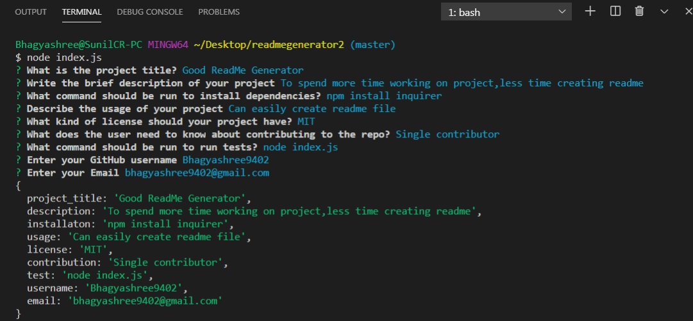

# Good ReadMe Generator

## Description
To spens more time working on project,less time creating readme

## Table of Contents
- [Installation](#installation)
- [Usage](#usage)
- [License](#license)
- [Contribution](#contribution)
- [Tests](#tests)
- [Questions](#questions)

## Installation
npm install inquirer

## Usage
Can easily create the readme file

## License
MIT

## Contribution
Single contributor

## Tests
npm install inquirer

## Questions
#### Link to GitHub page: https://github.com/Bhagyashree9402

#### Email: bhagyashree9402@gmail.com

## Video: [link](https://drive.google.com/file/d/1qULqFp7JGR6O2spMkeywQdbRaQNdiiSI/view)

## Demo Screenshot:
