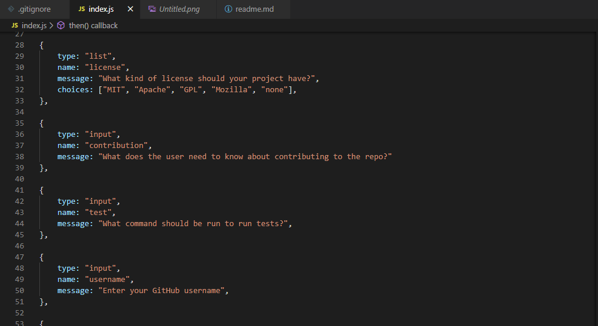

# Good ReadMe Generator

When creating an open source project on GitHub, it is important to have a quality README with information about the app--what is the app for, how to use the app, how to install it, how to report issues, and how to make contributions so that other developers are more likely to use and contribute to the success of the project. A command-line application will allow for quick and easy generation of a project README to get started quickly. This will allow a project creator to spend more time working on finishing the project and less time creating a good README.
Your task is to create a command-line application that dynamically generates a professional README.md from a user's input using the Inquirer package. Review the Good README guide as a reminder of everything that a quality, professional README contains. The application will be invoked with the following command:
node index.js
Because this is a command-line application that won’t be deployed, you’ll also need to provide a link to a walkthrough video that demonstrates the functionality of your application. Revisit the Screencastify Tutorial in the prework as a refresher on how to record video from your computer.

# User Story
AS A developer
I WANT a README generator
SO THAT can quickly create a professional README for a new project

## Description
Allows to spend more time working on project and less time on creating read me

## Table of Contents
- [Installation](#installation)
- [Usage](#usage)
- [License](#license)
- [Contribution](#contribution)
- [Tests](#tests)
- [Questions](#questions)

## Installation
npm install inquirer

## Usage
Can easily create readme file

## License
MIT

## Contribution
Single contributor

## Tests
node index.js

## Questions
#### Link to GitHub page: https://github.com/Bhagyashree9402

#### Email: bhagyashree9402@gmail.com

## Video: [link](https://drive.google.com/file/d/1qULqFp7JGR6O2spMkeywQdbRaQNdiiSI/view)

## Demo Screenshot:
